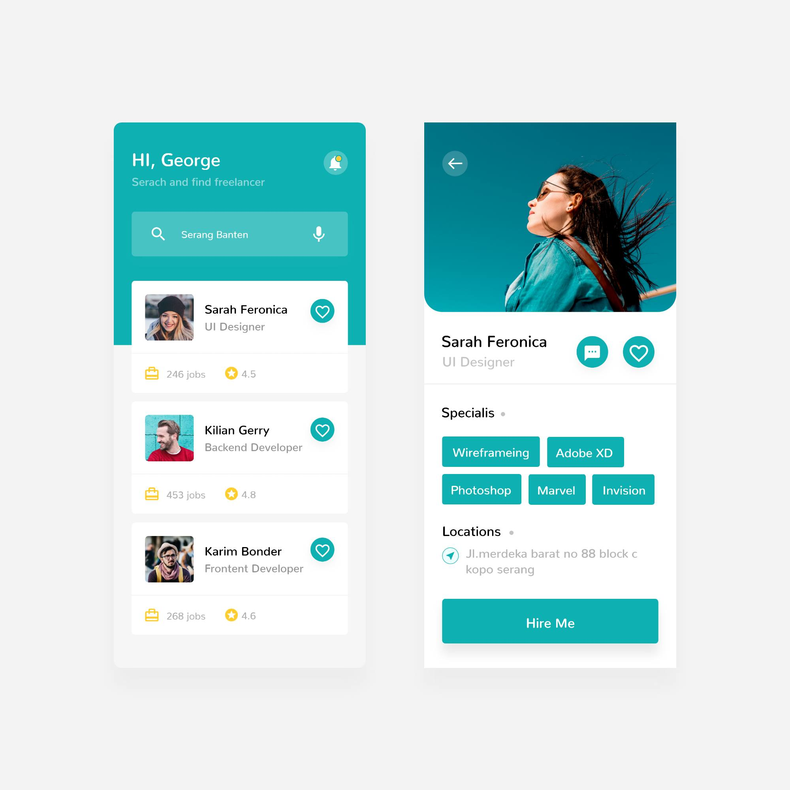
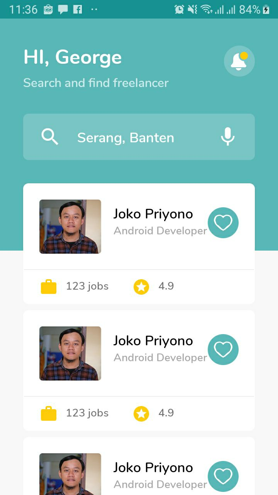
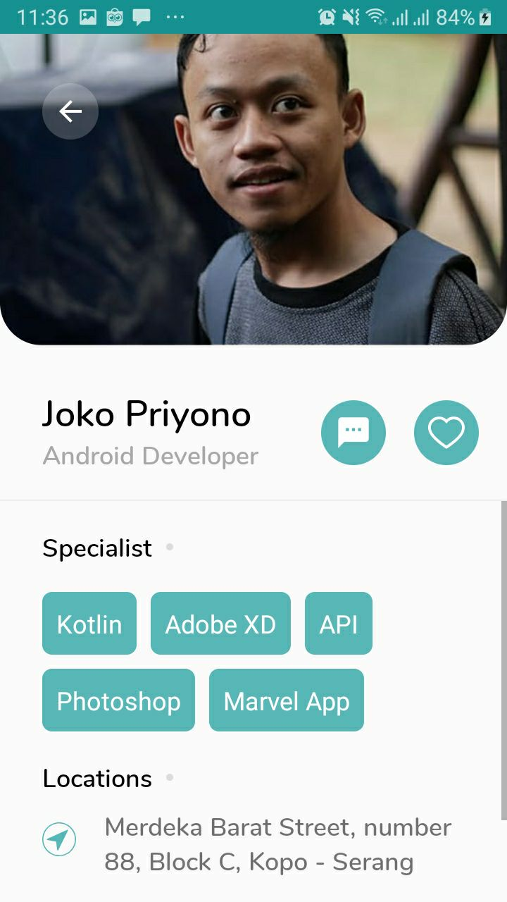
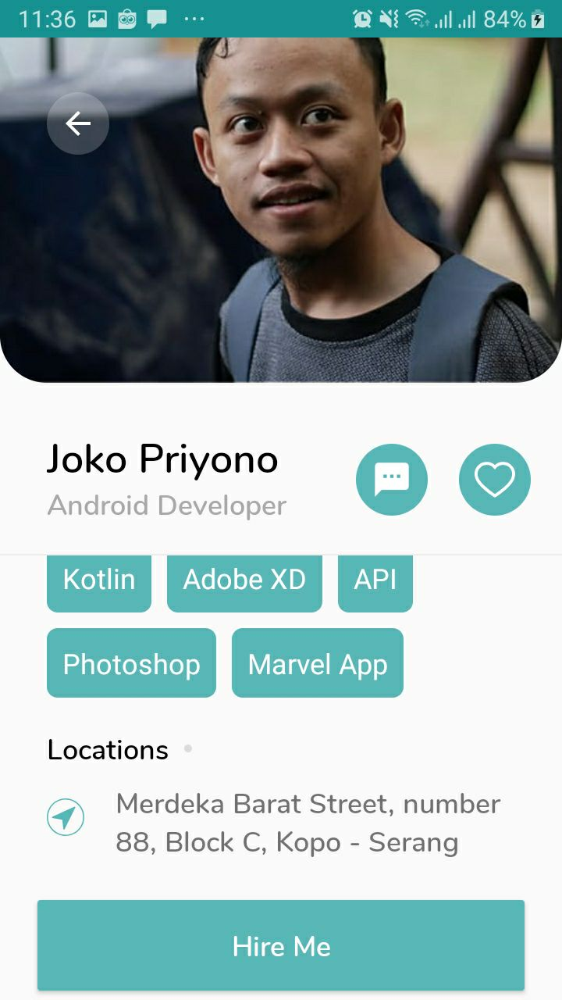

# Freelan!

This is a free XML template for Android, please also check awesome UI/UX from [Sutaryo]([https://dribbble.com/sutaryo](https://dribbble.com/sutaryo)) Dribbble 

and his [Facebook](https://www.facebook.com/tayo.net) account. This project builds pure using Kotlin ❤

## Screenshots

| Activities    |UI                                   |                                     |
|---------------|-------------------------------------|-------------------------------------|
|Main Activity  |  |                                     |
|Detail Activity|||
